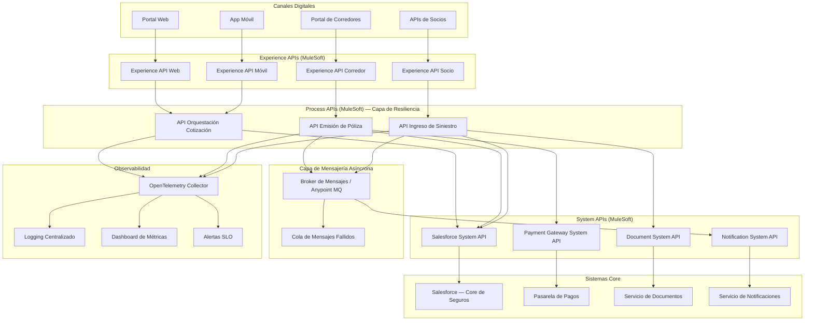

# Líder Técnico – Prueba Técnica Práctica
**Candidato:** Julian Torres
**Cargo:** Líder Técnico – Canal Digital Directo
**Empresa:** Sura

---

## Entregables

Este repositorio contiene todos los entregables de la prueba técnica práctica. Cada sección está documentada en `docs/` y todo el código en `src/`.

| Sección | Entregable | Archivo |
|---|---|---|
| **A – Arquitectura y Hoja de Ruta** | Arquitectura end-to-end + hoja de ruta 12 semanas + diagrama | [docs/section-a-architecture.md](docs/section-a-architecture.md) |
| **B – Framework de Integración** | Framework Python reutilizable + decisiones de diseño | [docs/section-b-framework.md](docs/section-b-framework.md) · [src/framework.py](src/framework.py) |
| **C – Servicio Demo** | Demo de confiabilidad con upstream inestable simulado | [docs/section-c-demo.md](docs/section-c-demo.md) · [src/demo.py](src/demo.py) |
| **D – Registro de Decisión Técnica** | ADR: centralizado vs. descentralizado · event-driven vs. síncrono | [docs/section-d-adr.md](docs/section-d-adr.md) |

---

## Diagrama de Arquitectura

El fuente del diagrama está en [diagrams/architecture.mmd](diagrams/architecture.mmd) (formato Mermaid).



---

## Ejecutar el Demo (Sección C)

Requisitos: Python 3.8+. Sin paquetes adicionales.

```bash
python src/demo.py
```

El demo inicia un upstream inestable simulado (Salesforce System API) y ejecuta una secuencia de solicitudes de emisión de pólizas, demostrando:

- Reintento con backoff exponencial y jitter en fallos transitorios (HTTP 503)
- Timeout por petición (5s) en respuestas lentas del upstream
- Circuit breaker que se abre tras el umbral de fallos
- Idempotencia: peticiones duplicadas servidas desde caché
- Logging JSON estructurado con propagación de trace ID

---

## Estructura del Repositorio

```
tech-assessment/
├── docs/
│   ├── section-a-architecture.md   # Arquitectura y hoja de ruta 12 semanas
│   ├── section-b-framework.md      # Decisiones de diseño del framework
│   ├── section-c-demo.md           # Instrucciones de ejecución y escenarios de fallo
│   └── section-d-adr.md            # Registros de Decisión Técnica (2 ADRs)
├── src/
│   ├── framework.py                # Framework de integración reutilizable
│   └── demo.py                     # Servicio demo con upstream inestable
├── diagrams/
│   └── architecture.mmd            # Diagrama de arquitectura (fuente Mermaid)
├── prep/                           # Material de preparación interno (no se entrega)
│   ├── concepts-glossary.md
│   └── interview-prep.md
├── Technical_Lead_Assessment.pdf   # Documento original de la prueba
└── README.md                       # Este archivo
```
