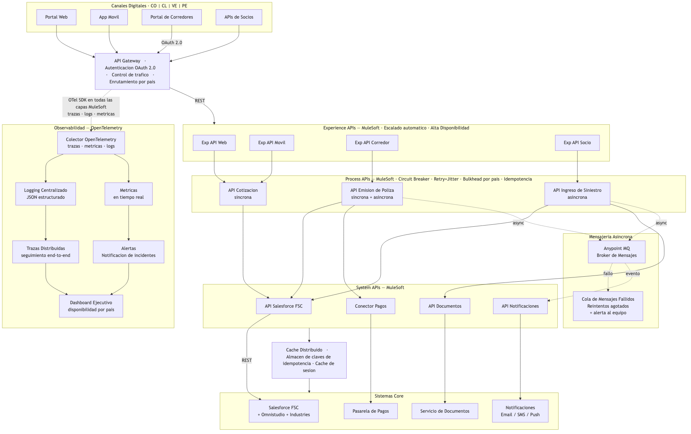

# Sección A – Arquitectura y Hoja de Ruta

---

## 1. Arquitectura Objetivo End-to-End — Canal Digital Directo Multi-País

### Visión General

La arquitectura objetivo está diseñada para un Canal Digital Directo de seguros multi-país, donde Salesforce actúa como el sistema de registro central y MuleSoft Anypoint Platform como el middleware de integración universal. Toda petición entrante desde canales digitales y toda petición saliente hacia sistemas externos fluye a través de la capa MuleSoft.

La arquitectura responde a cuatro pilares no funcionales:

- **Alta Disponibilidad:** Sin punto único de fallo; despliegue activo-activo en múltiples zonas de disponibilidad
- **Escalabilidad:** Escalado horizontal en la capa de runtime de MuleSoft; límites de governor de Salesforce gestionados mediante aislamiento por bulkhead
- **Resiliencia:** Reintento con backoff exponencial, circuit breaker y bulkhead aplicados en la capa de integración
- **Observabilidad:** Logging unificado, trazas distribuidas (OpenTelemetry) y dashboards en tiempo real sobre todos los flujos de integración

---

### Capas de la Arquitectura

#### Capa 1 — Canales Digitales (Consumidores)

- Portal web (autoservicio del cliente)
- Aplicación móvil
- Portal de agentes y corredores
- Socios externos (APIs)

Todos los canales se comunican exclusivamente a través de las Experience APIs de MuleSoft por HTTPS/REST. Ningún canal tiene acceso directo a Salesforce ni a los sistemas de backend.

#### Capa 2 — Integración API-Led con MuleSoft (Middleware)

Modelo de conectividad API-led de tres capas:

**Experience APIs**
- Adaptadores específicos por canal: uno por tipo de canal (web, móvil, corredor, socio)
- Maneja autenticación (OAuth 2.0 / Connected App), validación de peticiones y formateo de respuestas
- Aplica rate limiting y throttling por canal
- Inyecta correlation IDs y contexto de traza (OpenTelemetry) en cada petición

**Process APIs**
- Capa de orquestación: compone múltiples llamadas a System APIs para construir operaciones de negocio
- Implementa lógica de negocio: orquestación de cotizaciones, emisión de pólizas, ingreso de siniestros
- Aplica patrones de resiliencia: reintento con backoff exponencial + jitter, circuit breaker, validación de clave de idempotencia
- Enruta operaciones de larga duración al canal de mensajería asíncrona (según ADR-002)
- Gestiona manejo de errores y respuestas de fallback

**System APIs**
- Conectores delgados hacia sistemas de backend — sin lógica de negocio
- Salesforce System API: expone objetos de Salesforce (Account, Opportunity, Policy__c, Claim__c) como recursos REST
- Payment Gateway System API
- Document Generation System API
- Conectores a sistemas legados por país

#### Capa 3 — Sistemas Core

- **Salesforce:** Core de seguros (pólizas, siniestros, clientes, productos) — sistema de registro
- **Pasarela de Pagos:** Recaudo de primas y reembolsos
- **Servicio de Documentos:** Pólizas, certificados, informes de siniestros
- **Servicio de Notificaciones:** Email, SMS, notificaciones push
- **Sistemas por País:** Sistemas regulatorios locales, proveedores de pago locales

#### Capa 4 — Capa de Mensajería Asíncrona

Para flujos de larga duración y alto volumen (según ADR-002):

- Broker de mensajes (Anypoint MQ o equivalente cloud-native)
- Cola de mensajes fallidos (Dead Letter Queue - DLQ) para eventos con fallo de procesamiento
- Capacidad de replay de eventos para recuperación ante incidentes
- Consumer groups por país para aislar fallos de procesamiento

#### Capa 5 — Plataforma de Observabilidad

- **Trazas Distribuidas:** OpenTelemetry SDK en runtimes de MuleSoft; contexto de traza propagado via headers W3C Trace Context en límites síncronos y asíncronos
- **Logging Centralizado:** Logs JSON estructurados agregados en plataforma de gestión de logs (Splunk, ELK o Anypoint Monitoring)
- **Métricas:** Tasa de error, latencia p50/p95/p99, estado del circuit breaker, tasa de reintentos, profundidad de cola, consumer lag — por API y por país
- **Alertas:** Alertas basadas en SLO (tasa de consumo de error budget) que activan respuesta on-call

---

### Patrones de Integración Aplicados

#### Reintento con Backoff Exponencial y Jitter
Aplicado en la capa Process API para fallos transitorios (timeouts de red, respuestas 5xx de System APIs). Evita el thundering herd durante la recuperación del backend. Fórmula: `espera = min(cap, base * 2^intento) + jitter_aleatorio`.

#### Circuit Breaker
Cada conector de System API está envuelto por un circuit breaker. Tras un umbral de fallos configurable, el circuito se abre y retorna una respuesta de fallo rápido — protegiendo a Salesforce y otros backends de sobrecarga en cascada. Estados: Cerrado → Abierto → Semi-abierto → Cerrado.

#### Idempotencia
Toda operación mutante (emisión de póliza, procesamiento de pago) requiere una clave de idempotencia en el header de la petición. La capa Process API deduplica peticiones dentro de una ventana de tiempo configurable, evitando registros duplicados en Salesforce por peticiones reintentadas.

#### Bulkhead (Mamparo)
El patrón bulkhead aplica aislamiento de recursos en dos niveles:

1. **Capa Experience API:** Cada canal tiene su propio pool de hilos y límite de rate limiting. Si el portal web recibe un pico de tráfico o un ataque, solo su Experience API se ve afectada — la app móvil y el portal de corredores siguen operando normalmente. Ningún canal puede agotar los recursos de otro.

2. **Capa Process API / Sistema:** Los thread pools de MuleSoft están particionados por país y por nivel de criticidad del flujo. Un aluvión de peticiones para Colombia no agota los hilos que atienden a Venezuela. Los flujos críticos (cotización, pago) están aislados de los flujos batch y de reportes.

El resultado es que un fallo o pico en cualquier canal o país queda contenido — no se propaga al resto del sistema.

#### Caché
- **Caché de cotizaciones:** Catálogo de productos y precios cacheado en la capa Experience API (TTL: 5 minutos) — reduce llamadas a la API de Salesforce para peticiones de cotización de alta frecuencia
- **Caché de tokens:** Tokens de acceso OAuth cacheados hasta su expiración — elimina el overhead de autenticación por petición
- **Caché de datos de referencia:** Configuración por país, catálogo de productos, reglas de cobertura — refrescados por schedule, no por petición

#### Mensajería Asíncrona
La emisión de pólizas, notificación de siniestros y sincronización de datos entre países se enrutan a la capa de mensajería asíncrona (según ADR-002). Los productores (Process APIs) publican eventos y retornan un acuse de recibo inmediatamente. Los consumidores procesan eventos de forma independiente con soporte de reintento y DLQ.

---

### Alta Disponibilidad y Escalabilidad

- MuleSoft CloudHub 2.0 (o Runtime Fabric on-premises): despliegue activo-activo en múltiples zonas de disponibilidad
- Reglas de auto-escalado basadas en utilización de CPU y profundidad de cola de mensajes
- Volumen de llamadas a la API de Salesforce gestionado mediante aislamiento por bulkhead — cada país tiene una Connected App dedicada con su propia asignación de límites de API
- Load balancer con health checks en la capa Experience API — workers no saludables removidos de la rotación sin downtime
- HA en la capa de base de datos para el almacén de claves de idempotencia (caché distribuido, p. ej. Redis) con replicación

---

## 2. Diagrama de Arquitectura

---

## 3. Hoja de Ruta Técnica — 12 Semanas

Tres flujos de trabajo paralelos ejecutados durante 12 semanas:

#### Track 1 — Confiabilidad

| Semana | Actividad |
|:---:|---|
| 1 | Auditar configuraciones actuales de circuit breaker y reintento en todas las APIs de MuleSoft |
| 2 | Definir SLOs por API (disponibilidad, latencia p95, tasa de error) |
| 3 | Implementar aislamiento de thread pool por bulkhead por país en MuleSoft |
| 4 | Desplegar validación de clave de idempotencia para todas las Process APIs mutantes |
| 5 | Implementar reintento con backoff exponencial + jitter en todas las llamadas a System APIs |
| 6 | Revisión de confiabilidad: pruebas de chaos en escenarios de circuit breaker |
| 7 | Implementar capa de caché: catálogo de productos, tokens OAuth |
| 8 | Pruebas de carga: validar auto-escalado y aislamiento por bulkhead bajo tráfico pico |
| 9 | Implementar procesamiento y alertas de Dead Letter Queue |
| 10 | Chaos engineering: simular degradación de Salesforce; validar circuit breaker y fallback |
| 11 | Validación de HA multi-país: simular fallo de zona de disponibilidad |
| 12 | Cierre: todos los SLOs cumplidos, todos los caminos críticos probados |

#### Track 2 — Modernización de Integración

| Semana | Actividad |
|:---:|---|
| 1 | Inventariar todas las System APIs existentes e identificar duplicación entre países |
| 2 | Establecer estándares de diseño de API y política de versionamiento (semver) |
| 3 | Refactorizar conectores duplicados por país en System APIs compartidas |
| 4 | Migrar las 3 integraciones de mayor tráfico al nuevo patrón de System API |
| 5 | Implementar mensajería asíncrona para el flujo de emisión de pólizas |
| 6 | Implementar mensajería asíncrona para el flujo de notificación de siniestros |
| 7 | Publicar plantillas reutilizables de Experience API en Anypoint Exchange |
| 8 | Migrar segundo lote de integraciones por país al patrón compartido de System API |
| 9 | Implementar idempotencia en el consumidor de mensajes (deduplicación asíncrona) |
| 10 | Revisión de gobierno de APIs: deprecar integraciones directas legadas |
| 11 | Completar librería de assets en Anypoint Exchange: todas las APIs reutilizables documentadas |
| 12 | Cierre: sin integraciones directas a Salesforce que eviten MuleSoft |

#### Track 3 — Observabilidad y Operaciones

| Semana | Actividad |
|:---:|---|
| 1 | Desplegar OpenTelemetry collector; instrumentar las 5 Process APIs críticas principales |
| 2 | Implementar logging JSON estructurado con propagación de correlation ID |
| 3 | Construir primer dashboard de métricas: tasa de error, latencia, estado del circuit breaker |
| 4 | Definir reglas de alerta basadas en tasa de consumo de error budget del SLO |
| 5 | Instrumentar flujos asíncronos: profundidad de cola, consumer lag, tasa de DLQ |
| 6 | Primer runbook on-call: circuit breaker abierto, pico de DLQ, degradación de latencia |
| 7 | Trazas distribuidas end-to-end: propagación de traza en límites síncronos y asíncronos |
| 8 | Revisión de SLOs: ajustar umbrales con base en 4 semanas de datos de baseline |
| 9 | Informe de planeación de capacidad: límites de API de Salesforce por país, utilización de workers |
| 10 | Finalizar runbook on-call para todos los escenarios P1/P2 |
| 11 | Informe ejecutivo de observabilidad: cumplimiento de SLOs, tendencias de incidentes |
| 12 | Cierre: trazas, logs, métricas, alertas y runbooks completamente operativos |

### Resumen de Flujos de Trabajo

**Confiabilidad** — Semanas 1–12: Establecer y hacer cumplir patrones de resiliencia (circuit breaker, reintento, bulkhead, idempotencia, caché) en todos los flujos de integración. Validar bajo condiciones reales de fallo.

**Modernización de Integración** — Semanas 1–12: Consolidar integraciones fragmentadas por país en una capa de System APIs compartida. Eliminar el acceso directo a Salesforce. Publicar assets reutilizables en Anypoint Exchange. Adoptar mensajería asíncrona para flujos de larga duración.

**Observabilidad y Operaciones** — Semanas 1–12: Instrumentar todos los flujos críticos con OpenTelemetry. Construir dashboards, definir SLOs, configurar alertas y producir runbooks operativos. Transitar de operaciones reactivas a proactivas.
